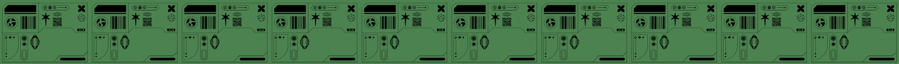
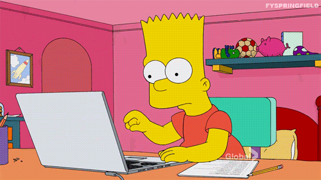

<!-- Header code -->

  

<!-- Introductory text code -->

  

<!-- Section 1 - Introduction code -->

  <!-- GIF -->
  

   

  <!-- TITLE -->
  <h2><code>❓ How would you describe yourself?</code></h2>
  
  <!-- GREEN BLOCK PARAGRAPH -->
  <table style="background-color:#4C824F; color:white; border-radius:10px; padding:20px; max-width:900px;">
    <tr>
    
       
      
       
      
       
    </tr>
  </table>

<!-- Section 2 - Tech Used code -->
<h2><code>💻 What technologies have you used?</code></h2> 

| Programming Languages | Backend / Tools | Databases | UI / UX Design |
|----------------------|-----------------|----------|----------------|
|  |  |  |  |
|  |  |  |  |
|  |  |  |  |

<!-- Section 3 - Achievements code -->
<h2><code>🏆 What are your achievements so far?</code></h2>

  
  
  
  
  
  
  

   

  
  
  
  
  
  
  

   

  
  
  
  
  
  
  

<!-- Section 4 - GitHub stats code -->
<h2><code>📈 What is the status of your GitHub statistics?</code></h2>

  
  

<!-- Quotation code -->

  
   
  <b>— Steve Jobs</b>

<!-- This is the business card code -->

  

<!-- Footer code -->

  

